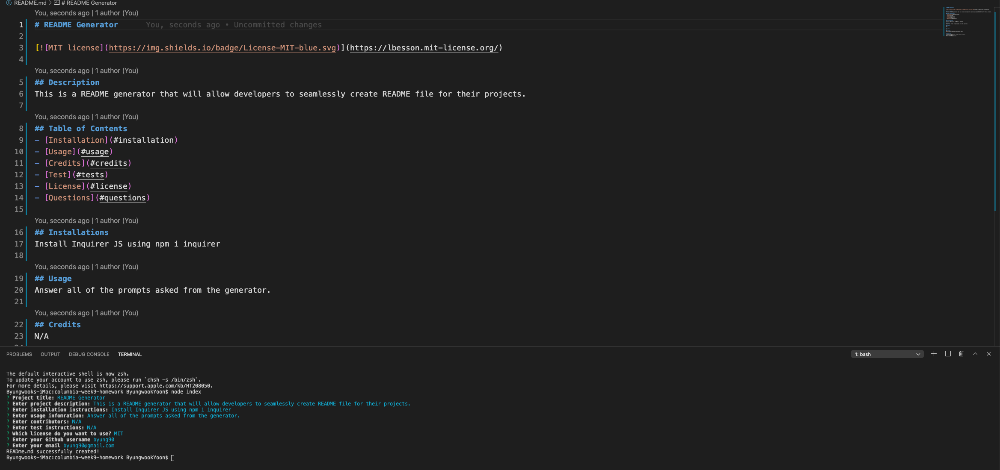

# README Generator

## Description
This is a README generator that will allow developers to seamlessly create README file for their projects.

## Table of Contents
- [Installation](#installation)
- [Usage](#usage)
- [Credits](#credits)
- [Test](#tests)
- [License](#license)
- [Questions](#questions)

## Installations
Install Inquirer JS using npm i inquirer

## Usage
Answer all of the prompts asked from the generator.

## Credits
N/A

## Tests
N/A

## License
[MIT](https://lbesson.mit-license.org/)

## Questions
If you have questions, please reach out here:
Github: byung90
Email: byung90@gmail.com